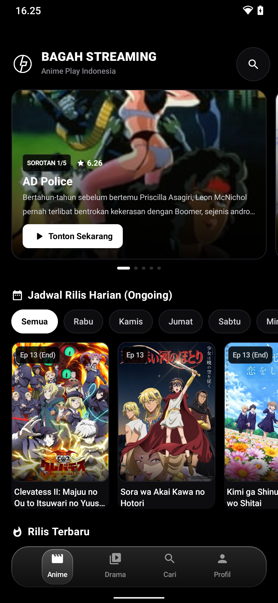
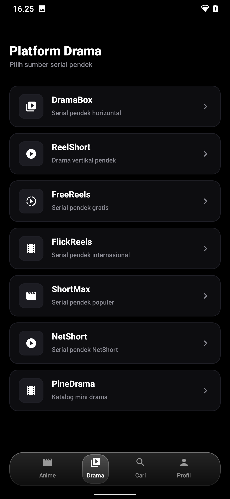
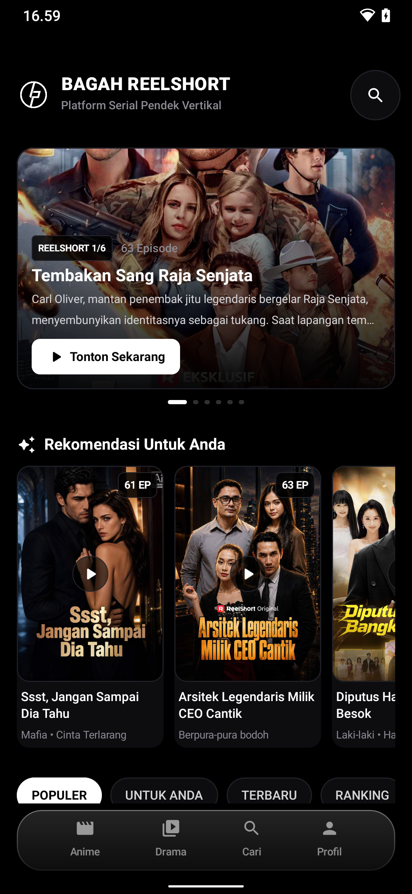

# Bagah Streaming

Aplikasi Android untuk menonton anime dan serial pendek (short drama) dari beberapa platform
dalam satu app. Dibangun dengan Kotlin dan Jetpack Compose.

Repo ini memakai API pihak ketiga `api.bagahproject.com` dan memerlukan API key untuk masuk.

## API Key

- **Key gratis untuk mencoba:** `dramakey` (kuota terbatas, saat ini 10.000 request).
- **Untuk API key unlimited**, order di: https://api.bagahproject.com/

Setelah punya key, masukkan di halaman login aplikasi. Key divalidasi ke endpoint
`check-key` lalu disimpan, jadi tidak perlu login ulang setelahnya.

## Fitur

- **7 platform serial pendek**: DramaBox, ReelShort, FreeReels, FlickReels, ShortMax, NetShort, PineDrama.
- **Anime Play Indonesia**: rilisan terbaru, ongoing dengan jadwal harian, movie, dan rekomendasi.
- **Login dengan API key**: validasi ke endpoint `check-key`, sesi disimpan sehingga tidak perlu login ulang kecuali data app dihapus atau app di-uninstall.
- **Halaman Profil**: info akun (nama, email, tier, role, kuota), tombol bersihkan cache, dan keluar.
- **Player seragam di semua platform**: durasi berjalan, tombol mundur/maju 10 detik, lanjut episode otomatis, dan layar tetap menyala saat menonton.
- **Subtitle Indonesia** otomatis di FreeReels.
- **Pencarian lintas platform** dengan pagination.
- **Filter per platform**: DramaBox (status, genre, urutan), ReelShort (periode ranking, genre, wilayah), FlickReels (urutkan, kanal, wilayah, tag), FreeReels (kategori), NetShort (ranking dan channel).
- **Performa**: cache disk (OkHttp) + cache memori dengan TTL per jenis endpoint, plus pull-to-refresh untuk memaksa data terbaru.

## Screenshot

<p>
  
  
  
</p>

Kiri ke kanan: Home Anime, daftar platform drama, dan Home ReelShort.

## Platform

| Platform   | Konten                          | Pemutaran                  |
| ---------- | ------------------------------- | -------------------------- |
| AnimePlay  | Anime (sub Indo)                | Media3 ExoPlayer           |
| DramaBox   | Serial pendek                   | MP4 terenkripsi (dekripsi AES-128-ECB per sample) |
| ReelShort  | Drama vertikal pendek           | HLS                        |
| FreeReels  | Serial pendek gratis + subtitle | HLS                        |
| FlickReels | Serial pendek internasional     | HLS                        |
| ShortMax   | Serial pendek populer           | HLS dengan segmen terenkripsi (dekripsi AES-128-CBC) |
| NetShort   | Serial pendek NetShort          | MP4 langsung               |
| PineDrama  | Katalog mini drama              | MP4 langsung               |

## Teknologi

- Kotlin 2.0, Jetpack Compose (Material 3)
- AndroidX Media3 ExoPlayer (MP4 dan HLS)
- Retrofit + kotlinx.serialization
- OkHttp (disk cache API) + cache memori
- Coil (gambar)
- Navigation Compose
- Arsitektur MVVM dengan repository

Min SDK 24, target/compile SDK 35.

## Menjalankan

1. Buka project di Android Studio (JDK 21 disarankan).
2. Build dan pasang ke perangkat atau emulator:

   ```bash
   ./gradlew :app:assembleDebug
   ./gradlew :app:installDebug
   ```

3. Buka app, masukkan API key di halaman login, lalu mulai menonton.

## Login

- Masukkan API key di halaman login. Key gratis untuk coba: `dramakey`. Untuk unlimited, order di https://api.bagahproject.com/ .
- API key divalidasi lewat `GET /api/check-key`.
- Key disimpan di `SharedPreferences` (nama `bagah_session`) melalui `SessionStore`.
- `NetworkClient` memakai key dinamis, tidak ada key yang ditulis di kode.

## Struktur Proyek

```
app/src/main/java/com/bagah/streaming/
  data/
    api/          Retrofit service, NetworkClient, interceptor dan cache
    cache/        Cache memori (TTL)
    model/        Model data per platform
    player/       Data source dekripsi DramaBox dan ShortMax
    repository/   Repository per platform dan auth
    session/      Penyimpanan sesi (API key)
  ui/
    components/   Komponen bersama (kartu, tab, bottom nav, kontrol player)
    navigation/   Definisi route
    screens/      Layar per fitur (auth, profile, anime, per platform)
    theme/        Warna dan tipografi
  MainActivity.kt
```

## Catatan

- Aplikasi ini bergantung pada API pihak ketiga. Ketersediaan konten dan stabilitas bisa berubah tanpa pemberitahuan.
- Beberapa feed (mis. "Untuk Anda" di ReelShort/ShortMax) jumlah item uniknya terbatas karena respons halaman dari API.
